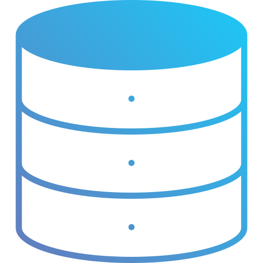

<div align="center" style="display: flex; justify-content: center; align-items: center;">
  
  <h1 style="font-weight: bold; margin: 0;">Convit3 Digital</h1>
</div>

<p align="center">
    <b>Convit3 Digital é uma plataforma para criar e gerenciar eventos digitais, permitindo acompanhar a confirmação de presença dos participantes, visualizar quem confirmou ou recusou o convite, e organizar todos os detalhes em um só lugar.</b>
</p>

---

## Tecnologias 
---

### Front-end
- **React.js** 
- **Next.js** 
- **TypeScript** 
- **Tailwind CSS** 

---

### Back-end
- **Nest.js** 

---

### Banco de Dados Relacional 

- **SqLite** 

- **PostgreSQL** 

---
## Instalar pacotes

### 1. Entrar na pasta do projeto
```bash
cd apps/front-end/
```
### 2. Instalar React e React-dom caso tenha acontecido algum problema na hora de executar.
```bash
npm install react@latest react-dom@latest
```

### 3. Atualizar o Next.js caso tenha acontecido algum problema na hora de executar.
```bash
npm install next@latest
```

### 3. React Qr-Code
```bash
npm i react-qr-code
```

### 4. Instalar Nest.JS
```
npm i -g @nestjs/cli
```

### 5. Instalar o NPM-RUN-ALL:
```
npm i npm-run-all
```
### 6. Instalar o tsup:
```
npm i -D tsup
```

### 7. Instalar o UUID (id único):
```
npm i uuid
```

### 8. Instalar o Types/uuid:
```
npm i -D @types/uuid
```

### 9. Prisma Orm:

### 9.1 Entrar na pasta do back-end:
```
cd apps/back-end
```

### 9.2 Instalar o prisma orm:
```
npm install prisma --save-dev
```

### 9.3 Iniciar o prisma e seta banco de dados SqlLite:
```
npx prisma init --datasource-provider sqlite
```

### 9.4 Criando Prisma Client:
```
npx prisma migrate dev
```

## Nest:

### Gerando um modulo usando Nest:
```
nest generate module eventos
```

### Gerando um Controller:
```
nest generate controller eventos --flat --no-spec
```


## Como executar o projeto usando o NPM-RUN-ALL:

### 1. Executando o projeto:
```
npm run dev
```