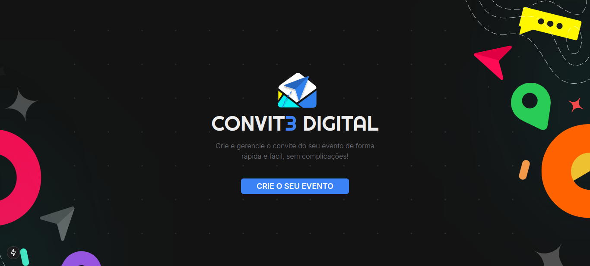

<div align="center">
  
  <h1>Convit3 Digital</h1>
</div>

[](https://react.dev)
[](https://nextjs.org)
[](https://tailwindcss.com)
[](https://developer.mozilla.org/pt-BR/docs/Web/JavaScript)
[](https://nodejs.org/pt)
[](https://www.typescriptlang.org)
[](https://nestjs.com)
[](https://www.prisma.io)
[](https://www.sqlite.org)


<p align="center">
 <a href="#about">Sobre</a> • 
 <a href="#started">Começando</a> • 
  <a href="#colab">Contribuidores</a> •
 <a href="#contribute">Contribuir</a>
</p>

<p align="center">
    
</p>

<h2 id="started">📌 Sobre</h2>
<b>Convit3 Digital</b> é uma plataforma intuitiva para criar e gerenciar eventos digitais. Com ela, você pode acompanhar as confirmações de presença dos participantes, visualizar quem confirmou ou recusou os convites e organizar todos os detalhes do evento em um único lugar.

<h2 id="started">🚀 Começando</h2>

### Instale as dependências do Front-End:
```bash
cd apps/front-end
npm install
```

### Instale as dependências do Back-End:
```bash
cd apps/back-end
npm install
```


<h3>Pré-Requisitos</h3>

- [React 18](https://react.dev)
- [React 18-dom](https://react.dev)
- [Next.js](https://nextjs.org)
- [Nest.js](https://nestjs.com)


<h3>Como clonar o projeto<h3>

```bash
git clone https://github.com/josiasdev/convit3-digital.git
```

<h3>Como iniciar o projeto<h3>

```bash
cd convit3\ digital/
npm run dev
```

<h3>Agora abra no navegador</h3>

[http://localhost:3000](http://localhost:3000)

<h2 id="colab">🤝 Contribuidores</h2>

<table>
<tr>
<td align="center">
      <a href="https://github.com/josiasdev">
        
        <br>
        <sub>
          <b>josiasdev</b>
        </sub>
      </a>
    </td>
    </tr>
</table>


<h2 id="contribute">📫 Contribuir</h2>


1. `git clone https://github.com/josiasdev/convit3-digital.git`
2. `git checkout -b feature/NAME`
3. Siga os padrões de commit
4. Abra um Pull Request explicando o problema resolvido ou o recurso criado, se houver, anexe uma captura de tela das modificações visuais e aguarde a revisão!

<h3>Documentações que podem ajudar</h3>

[📝 Como criar um Pull Request](https://www.atlassian.com/br/git/tutorials/making-a-pull-request)

[💾 Padrão de Commit](https://gist.github.com/joshbuchea/6f47e86d2510bce28f8e7f42ae84c716)


<h2 id="license">Licença  📃 </h2>

Este projeto está sob a licença [MIT](LICENSE) license