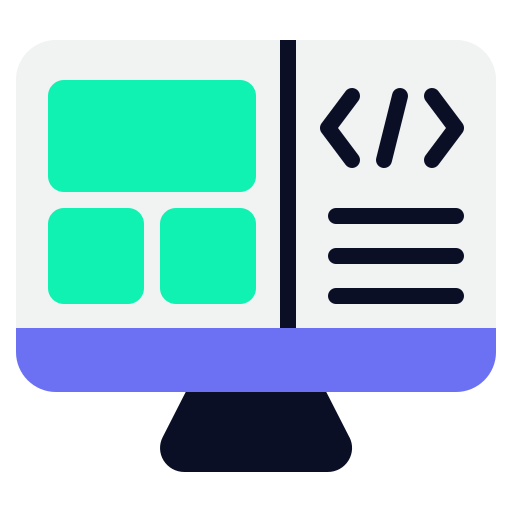

<div style="display: flex; justify-content: center; align-items: center;">
  <h1 style="font-weight: bold; margin: 0;">Convit3 Digital</h1>
  
</div>


<p align="center">
    <b>
	um sistema para criar eventos digitais e ver quantas pessoas estão confirmadas e quem não vai.
    </b>
</p>

<div style="display: flex;">
<h2 id="technologies">Tecnologias</h2>

</div>

<div style="display: flex;">
<h3 id="technologies">Front-end:</h3>

</div>
<div>
 <b>• React.js</b> 
</div>
<div>
 <b>• Next.js</b> 
</div>
<div>
 <b>• TypeScript </b>
</div>
<div>
 <b> • Tailwind CSS</b>
</div>


<div style="display: flex;">
<h3 id="technologies">Banco de Dados Relacional:</h3>

</div>
<div>
 <b>• PostgreSQL</b>
</div>


### 1. Criar Projeto usando Next.js

```
npx create-next-app@latest front-end
```
### 2. Entrar na pasta do Projeto Next.js

```
cd front-end
```


### 3. Executar Projeto com Next.js

```
npm run dev
```